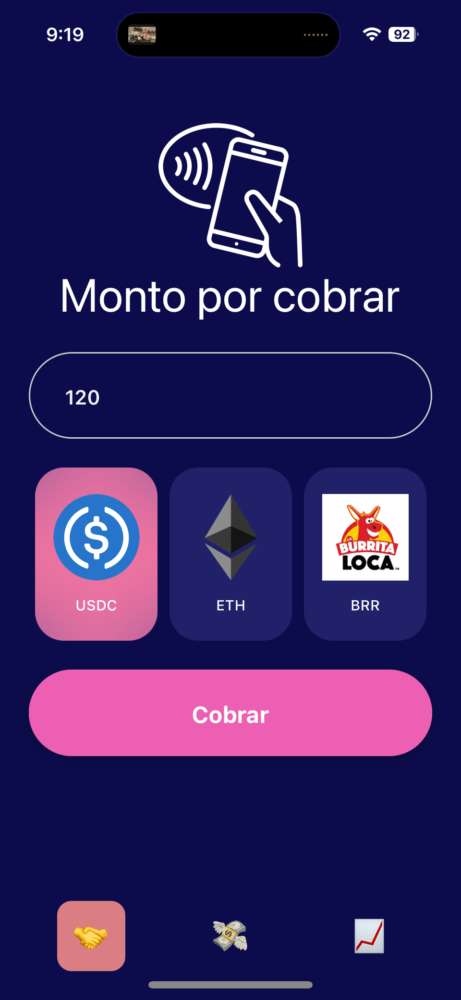
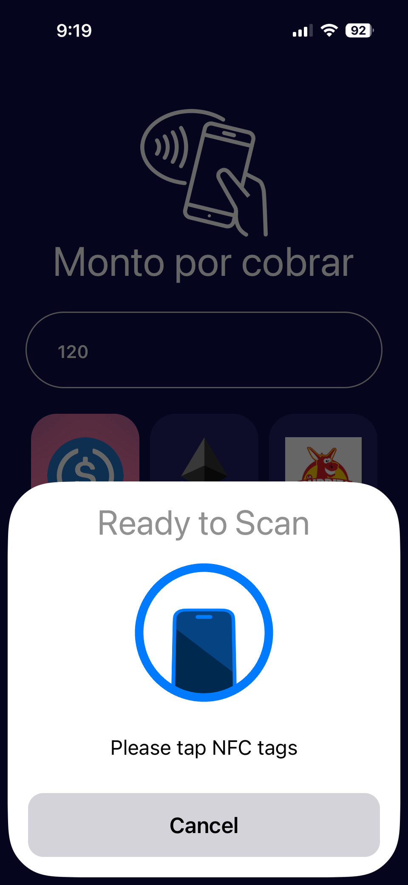
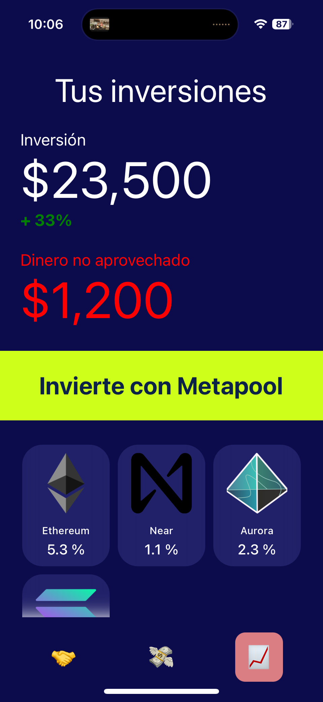
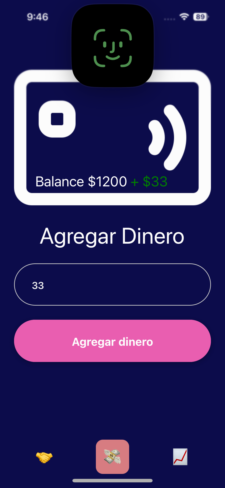
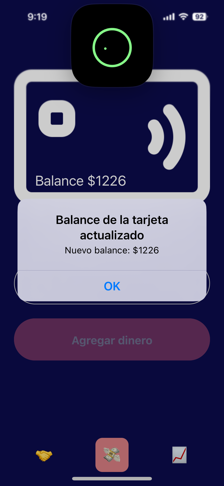

#  Starkpay

La opción más barata de latinoamérica para cobros digitales. Acepta dólar digital y comienza a ganar con Metapool.

     
    
     

## Links relevantes

| What? | Link |
|---|---|
| USDC on Starknet contract address | https://goerli.voyager.online/contract/0x005a643907b9a4bc6a55e9069c4fd5fd1f5c79a22470690f75556c4736e34426 |
| Burrita Loca (BRR) on Starknet contract address | https://goerli.voyager.online/contract/0x07e4a44d5d8c9ebd88fb40ca3fe2293178c4e7fe980d91232eaf967bb632ddd0 |
| ERC-20 Burrita Loca (BRR) on Scroll testnet contract address | https://sepolia.scrollscan.dev/address/0x52A13eF30Da4a73aAB8CB1d033C37dB201ea014c |
| Pitch Deck | https://docs.google.com/presentation/d/1wiwfKNda18KLr37W46VBkOegxWZhi2Ub8ijhb-qvMdI/edit?usp=sharing |
| Convertidor de fiat a ETH usando Chainlink price feed | https://github.com/haycarlitos/chainlink-price-feed |
| Whitelist Scroll contract address | jljl344j  |

## ¿Cómo funciona?

### Comercio
1. Elige en qué moneda quieres cobrar. La opción con menor comisión de transferencia (USDC en Starknet) es seleccionada por defecto. 

     
    
     

2. Deja que el usuario acerque su tarjeta Starkpay a tu celular para pagar.

     
    
     

3. Recibe tu dinero al instante. Ahorra con Metapool con un solo click.

     
    
     

### Usuario
1. Crea tu cuenta con FaceID. 

     
    
     

2. Recarga con tu teléfono tu tarjeta Starkpay.

     
    
     

3. Paga con tu tarjeta en cualquier comercio con el logo de StarkPay.
4. Waku te avisará cuando llegue tu dinero.

### Contenido del repositorio
Éste proyecto está pensado para replicarse y experimentar nuevas formas de incluir a la población no bancarizada de latinoamérica a opciones para cobrar, pagar e invertir sus ingresos.

El repositorio contiene:
1. Aplicación en React Native con integración de NFC y FaceID.
2. Backend para transferir ERC-20 en Starknet.
3. Backend para transferir ERC-20 en Scroll.
4. Ejemplo de cómo integrar Metapool.
5. Contrato de ERC-20.
6. Endpoint para hacer staking en Metapool.
7. Contrato whitelist.sol en Solidity.

### ADVERTENCIA Y FUNCIONALIDADES PENDIENTES
Starkpay fue desarrollado durante ETH LATAM 2024. No está listo para ser usado en producción por motivos de seguridad.

Funcionalidades que faltan:
1. Crear wallet con FaceID al momento de registrarse en Starkpay. (Usa account abstraction nativo de Starknet)
2. Decentralizar el backend. (Puedes usar ICP)
3. Integrar off-ramp.

### El futuro de LATAM se construye en español
Contáctanos para feedback o abre un issue en este repositorio.
-  Carlos https://linktr.ee/diosplan
-  Roberto https://linktr.ee/robertoyamanaka
-  Toño https://linktr.ee/toony1908

### Aprende más
Estos son recursos que puedes consultar para seguir construyendo la infraestructura financiera de LATAM.
1. El libro de Starknet https://book.starknet.io/es/index.html
2. Documentación de Scroll https://docs.scroll.io/es/home/
3. Documentación de Metapool https://docs.metapool.app/master
