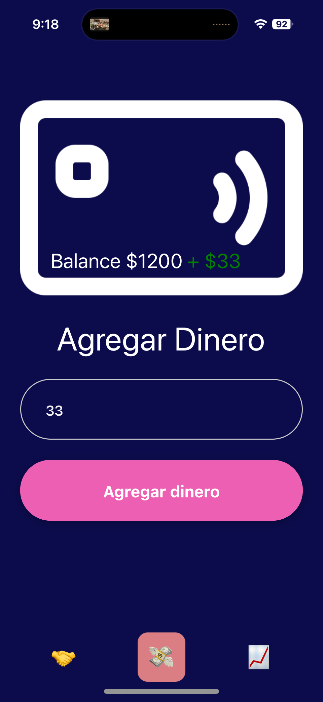

#  Starkpay

La opción más barata de latinoamérica para cobros digitales. Acepta dólar digital y comienza a ganar con Metapool.

     
    
     

## Links relevantes

| What? | Link |
|---|---|
| USDC on Starknet contract address | https://goerli.voyager.online/contract/0x005a643907b9a4bc6a55e9069c4fd5fd1f5c79a22470690f75556c4736e34426 |
| Burrita Loca (BRR) on Starknet contract address | https://goerli.voyager.online/contract/0x07e4a44d5d8c9ebd88fb40ca3fe2293178c4e7fe980d91232eaf967bb632ddd0 |
| Burrita Loca (BRR) on Scroll testnet contract address | https://sepolia.scrollscan.dev/address/0x52A13eF30Da4a73aAB8CB1d033C37dB201ea014c |
| Metapool Endpoint | pendiente... |

     
    
     

## ¿Cómo funciona?

### Comercio
1. Elige en qué moneda quieres cobrar. La opción con menor comisión de transferencia (USDC en Starknet) es seleccionada por defecto. 

     
    
     

2. Deja que el usuario acerque su tarjeta Starkpay a tu celular para pagar.

     
    
     

3. Recibe tu dinero al instante. Ahorra con Metapool con un solo click.

     
    
     

### Usuario
1. Crea tu cuenta con FaceID. 

     
    
     

2. Recarga con tu teléfono tu tarjeta Starkpay.

     
    
     

3. Paga con tu tarjeta en cualquier comercio con el logo de StarkPay
